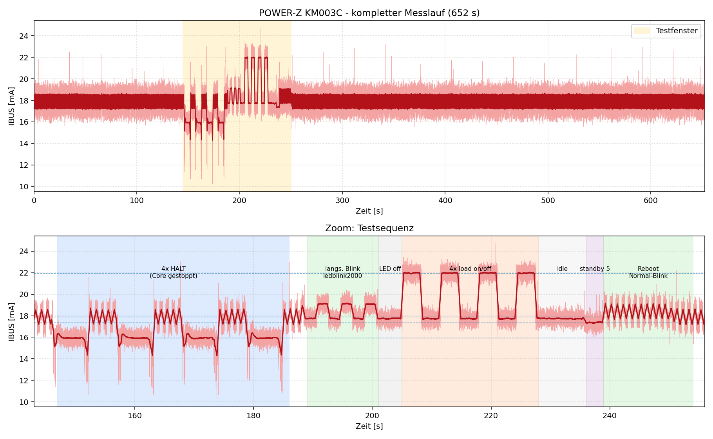

# Strommessung PIC32CM PL10 Curiosity Nano — Testlauf-Analyse

Messgerät: **POWER-Z KM003C** (USB-Inline-Strommessung, 1 kHz, Auflösung < 1 mA).
Quelle: `user data.csv` → geglättet via `plot_current.py` → `stromverlauf_smooth.csv`.

## Testsequenz

Automatisiert gefahren (serielle Konsole COM13 @115200 + pyOCD), parallel zur laufenden Strommessung:

1. **4× Reset/Halt** — MCU per Debugger anhalten und wieder loslassen
2. **`led blink 2000`** — Blinkperiode auf 4 s, damit die volle Ladekurve als Rechteck sichtbar wird
3. **`led off`**
4. **4× `load on` / `load off`** — volle CPU-Rechenlast im Wechsel mit Idle
5. ein paar Sekunden warten
6. **`standby 5`** — ~5 s in PM-Standby, danach Reboot in den Standard-Blink

## Ergebnis

Oben der komplette 652‑s‑Lauf (Testfenster gelb), unten der Zoom mit allen Phasen.

### Gemessene Pegel je Phase

| Phase | Strom (geglättet) | Bedeutung |
|---|---|---|
| **4× HALT** (Core per Debugger gestoppt) | **15,93 mA** | CPU steht, Clocks laufen |
| Standby 5 (Target ~2 µA) | 17,37 mA | *fast keine* Absenkung |
| Idle, LED aus | 17,73 mA | Target idle (WFI) |
| Normal-Blink (Betrieb) | 17,90 mA | Blink 500 ms + idle |
| **Load on** (CPU 100 %) | **21,97 mA** | volle Rechenlast |

### Nulllage (Referenz)

**Der Sockelstrom des Boards ist als `15,93 mA` festgelegt** — der Wert, wenn der Core
vom Debugger gestoppt ist (CPU steht, nur Board-Grundlast: nEDBG-Debugchip + Regler).
Diese Nulllage ist ab jetzt der Bezugspunkt; **alles darüber ist Controller-Verbrauch.**

### Controller-Verbrauch (Pegel − Nulllage 15,93 mA)

| Phase | absolut | **Controller-Anteil** |
|---|---|---|
| Halt (Nulllage) | 15,93 mA | **0,00 mA** (Referenz) |
| Standby 5 | 17,37 mA | **+1,44 mA** |
| Idle, LED aus | 17,73 mA | +1,80 mA |
| Normal-Blink | 17,90 mA | +1,97 mA |
| Load on (CPU 100 %) | 21,97 mA | **+6,04 mA** |

Die reine CPU-Rechenlast (Load − Idle = +4,24 mA) deckt sich mit dem Datenblatt (Active−Idle ≈ 4 mA).

## Kernaussage zum Sockelstrom

**Der Board-Sockel lässt sich von der USB-Seite aus nicht sauber isolieren — der On-Board-Debugger (nEDBG) + Spannungsregler dominieren alles.**

- Die **~14–18 mA sind zum weit überwiegenden Teil Board-Sockel** (nEDBG-Debugchip + Regler), den die Firmware **nicht abschalten kann**.
- Der **Target-Controller** selbst ist nur ein kleiner Reiter darauf: +2 mA im Betrieb, +4–6 mA unter Volllast.
- **Entscheidend:** `standby 5` senkte den Strom um **nur 0,36 mA** und nur kurz — die erwarteten ~2 µA des Targets gehen komplett im Board-Sockel unter. Auffällig: der per Debugger *gehaltene* Core zog mit 15,9 mA sogar **weniger** als die Firmware-Standby-Phase (eigenes Follow-up wert).

**Fazit:** Die Annahme „Gesamtstrom = Sockel + Controller" stimmt, aber das Verhältnis ist umgekehrt zur Erwartung — der Sockel (Debugger) ist groß und fix, der Controller-Anteil klein. Um den **echten** Controller-Strom (und damit den reinen Board-Sockel) zu bestimmen, muss die **Target-Rail per J201 aufgetrennt** und separat gemessen werden (Curiosity-Nano User Guide §5.5). Von der USB-Buchse aus sind nur die **Deltas** messbar, nicht der absolute µA-Wert.
